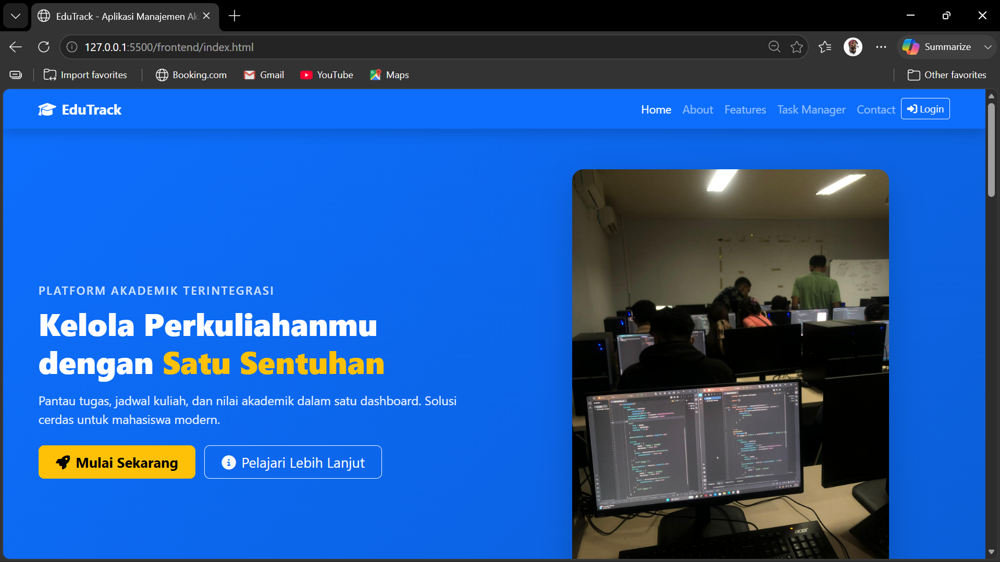
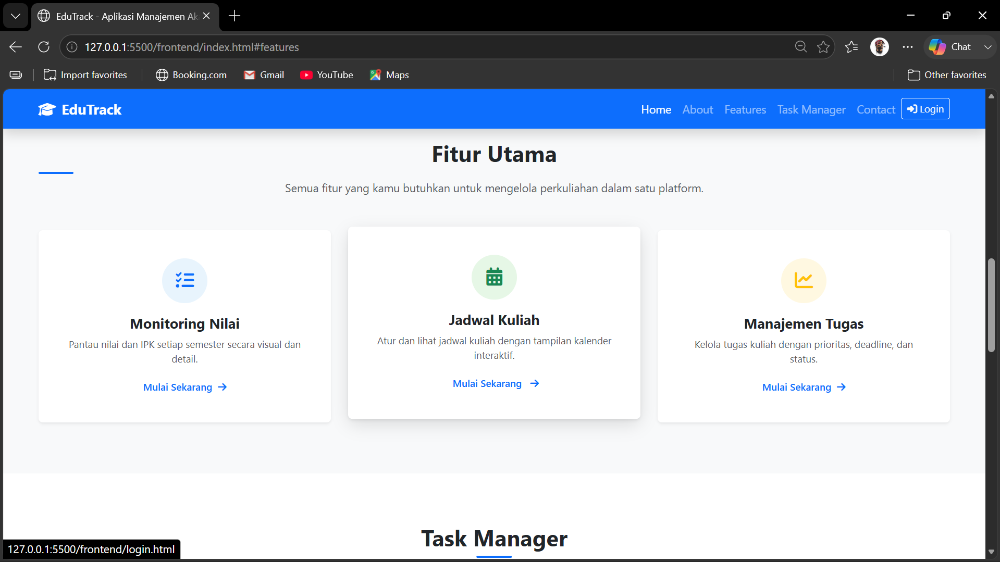
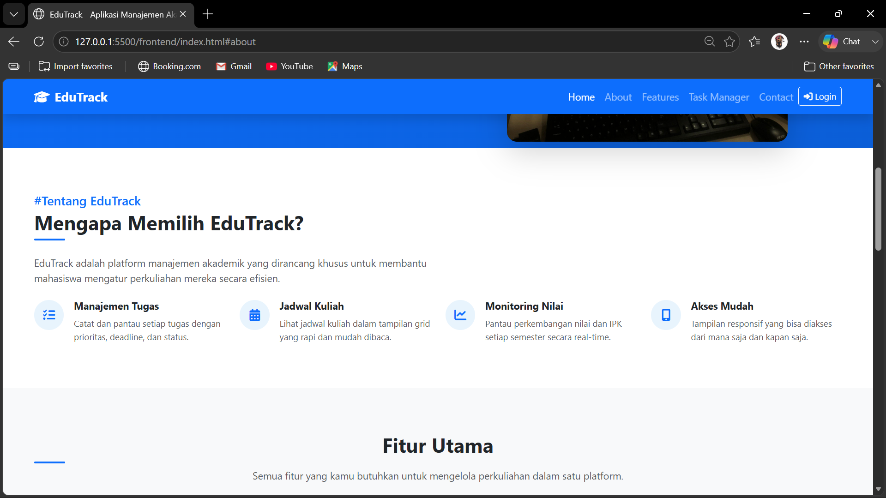
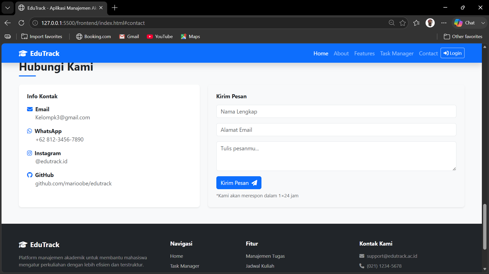

# EduTrack

EduTrack adalah platform manajemen akademik berbasis web yang membantu mahasiswa mengelola perkuliahan secara efisien — mulai dari tugas, jadwal kuliah, hingga monitoring nilai dan IPK.

## Daftar Isi

- [Latar Belakang](#latar-belakang)
- [Fitur](#fitur)
- [Halaman Aplikasi](#halaman-aplikasi)
- [Tech Stack](#tech-stack)
- [Arsitektur Sistem](#arsitektur-sistem)
- [Struktur Proyek](#struktur-proyek)
- [Database](#database)
- [Instalasi & Menjalankan](#instalasi--menjalankan)
- [API Endpoints](#api-endpoints)
- [Testing](#testing)
- [Screenshots](#screenshots)
- [Dibuat Oleh](#dibuat-oleh)

## Latar Belakang

Mahasiswa seringkali kesulitan dalam mengelola tugas, jadwal kuliah, dan nilai akademik karena tersebar di berbagai platform (SIAKAD, LMS, catatan pribadi). EduTrack hadir sebagai solusi terintegrasi yang memungkinkan mahasiswa memantau seluruh aktivitas akademik dalam satu dashboard.

Platform ini dibangun sebagai proyek pengembangan web menggunakan pendekatan **Vanilla JavaScript** pada frontend dan **Express.js** pada backend dengan database **MySQL**.

## Fitur

| Fitur | Deskripsi |
|-------|-----------|
| **Manajemen Tugas** | Catat, prioritaskan (tinggi/sedang/rendah), dan pantau tugas kuliah dengan filter status, prioritas, dan mata kuliah. Dilengkapi indikator deadline (warning/danger). |
| **Jadwal Kuliah** | Atur jadwal dalam tampilan grid kalender dengan deteksi bentrok otomatis. Tersedia tampilan mobile. |
| **Monitoring Nilai** | Pantau nilai angka, huruf, bobot, dan IPK per semester dengan visualisasi distribusi grafik. |
| **Profil Akademik** | Ringkasan IPK, SKS, progress tugas, jadwal hari ini, dan grafik IPK per semester. Upload foto profil. |
| **Task Manager** | Dashboard ringkasan stats tugas aktif, jumlah jadwal, dan IPK. |
| **Autentikasi JWT** | Register, login, dan manajemen session dengan token. Proteksi halaman via middleware frontend & backend. |
| **Dark / Light Theme** | Toggle tema gelap/terang dengan preferensi tersimpan di localStorage. Animasi card fadeInUp + hover lift. |
| **Newsletter** | Form subscribe newsletter dengan notifikasi email via SMTP (Gmail). |
| **Kontak** | Form kirim pesan yang tersimpan di database. |
| **Responsive Design** | Tampilan mobile-friendly dengan Bootstrap 5. |
| **Indikasi Navigasi** | Active nav-link dengan underline biru via pseudo-element, konsisten tanpa shifting. |

## Halaman Aplikasi

| Halaman | File | Autentikasi | Deskripsi |
|---------|------|-------------|-----------|
| Landing Page | `index.html` | - | Halaman utama dengan hero, fitur, newsletter, kontak |
| Login | `login.html` | - | Form login, dukungan parameter `?expired=` dan `?next=` |
| Register | `register.html` | - | Form registrasi dengan validasi password |
| Task Manager | `taskmanager.html` | ✅ | Dashboard stats tugas, jadwal, IPK |
| Manajemen Tugas | `tugas.html` | ✅ | CRUD tugas dengan filter dan progress |
| Jadwal Kuliah | `jadwal.html` | ✅ | CRUD jadwal dengan kalender grid |
| Monitoring Nilai | `nilai.html` | ✅ | CRUD nilai dengan IPK, distribusi, filter semester |
| Profil | `profile.html` | ✅ | Edit profil, ganti password, upload foto, ringkasan akademik |
| Broadcast | `broadcast.html` | ✅ | Kirim newsletter ke subscriber |

## Tech Stack

| Layer | Teknologi | Keterangan |
|-------|-----------|------------|
| **Frontend** | HTML5, CSS3, Bootstrap 5.3 | Struktur & styling |
| | Vanilla JavaScript (ES6+) | Logic frontend tanpa framework (Fetch API, DOM manipulation) |
| | Font Awesome 6 | Icon set |
| **Backend** | Node.js | Runtime JavaScript |
| | Express.js 5 | Web framework untuk REST API |
| | JSON Web Token (JWT) | Autentikasi & session management |
| | bcryptjs | Hashing password |
| | Multer | Upload file (foto profil) |
| | Nodemailer | Pengiriman email (newsletter) |
| **Database** | MySQL 8 | Relational database |
| | mysql2/promise | Database driver dengan connection pool |
| **Server** | Apache (XAMPP) | Serve static frontend |
| | Node.js | Serve backend API (port 3000) |

## Arsitektur Sistem

```
Browser
  │
  ├── http://localhost/PengembanganWEB/edutrack1/
  │         │
  │         ▼ (Apache via XAMPP)
  │    ┌──────────────┐
  │    │  Frontend     │  HTML + CSS + Vanilla JS
  │    │  (.htaccess   │  (static files)
  │    │   rewrite)    │
  │    └──────┬───────┘
  │           │ fetch('http://localhost:3000/api/...')
  │           ▼
  │    ┌──────────────┐
  │    │  Backend API  │  Node.js + Express (port 3000)
  │    │  (server.js)  │  Routes → Controllers → Database
  │    └──────┬───────┘
  │           │ mysql2/promise
  │           ▼
  │    ┌──────────────┐
  │    │  MySQL        │  Database edutrack1_db
  │    │  (XAMPP)      │  Tables: users, tasks, matkul,
  │    └──────────────┘         jadwal, nilai, contacts,
  │                             newsletter_subscribers
```

**Alur Autentikasi:**
1. User login → backend validasi → kirim JWT token
2. Token disimpan di `localStorage`
3. Setiap request API menyertakan `Authorization: Bearer <token>`
4. Middleware backend verifikasi JWT
5. Frontend `auth-check.js` redirect ke login jika token tidak valid/kedaluwarsa

## Struktur Proyek

```
edutrack1/
├── .htaccess                  # Rewrite root → frontend/
├── package.json               # Dependencies Node.js
├── backend/
│   ├── config/
│   │   └── db.js              # Koneksi database (pool)
│   ├── controllers/           # Logic setiap fitur
│   │   ├── authController.js
│   │   ├── taskController.js
│   │   ├── matkulController.js
│   │   ├── jadwalController.js
│   │   ├── nilaiController.js
│   │   ├── contactController.js
│   │   └── newsletterController.js
│   ├── middleware/
│   │   └── auth.js            # Auth middleware (JWT verify)
│   ├── routes/                # Routes API
│   │   ├── auth.js
│   │   ├── tasks.js
│   │   ├── matkul.js
│   │   ├── jadwal.js
│   │   ├── nilai.js
│   │   ├── contact.js
│   │   └── newsletter.js
│   ├── uploads/profiles/      # Foto profil user
│   ├── .env                   # Konfigurasi environment
│   └── server.js              # Entry point (port 3000)
├── frontend/
│   ├── css/                   # CSS per halaman
│   │   ├── index.css
│   │   ├── jadwal.css
│   │   ├── nilai.css
│   │   ├── profile.css
│   │   └── tugas.css
│   ├── js/                    # JavaScript per halaman
│   │   ├── index.js
│   │   ├── login.js
│   │   ├── register.js
│   │   ├── tugas.js
│   │ ├── jadwal.js
│   │ ├── nilai.js
│   │ ├── profile.js
│   │ ├── taskmanager.js
│   │ ├── broadcast.js
│   │ └── theme-toggle.js      # Dark/light theme toggle
│   ├── auth-check.js          # Middleware auth frontend
│   ├── style.css              # Shared styles (tema, animasi, navbar)
│   ├── index.html             # Landing page
│   ├── login.html             # Login
│   ├── register.html          # Register
│   ├── taskmanager.html       # Dashboard task manager
│   ├── tugas.html             # Manajemen tugas
│   ├── jadwal.html            # Jadwal kuliah
│   ├── nilai.html             # Monitoring nilai
│   ├── profile.html           # Profil akademik
│   └── broadcast.html         # Kirim newsletter
├── database/
│   └── edutrack_db.sql        # Schema & seed database
├── docs/
│   ├── API.md                 # Dokumentasi API lengkap
│   └── testing-checklist.md   # Checklist testing
├── img/                       # Gambar untuk landing page
└── .gitignore
```

## Database

### Entity Relationship

| Table | Primary Key | Foreign Key | Deskripsi |
|-------|-------------|-------------|-----------|
| `users` | `id` | - | Data user (nama, email, password, nim, prodi, foto) |
| `tasks` | `id` | `user_id` → users.id | Tugas kuliah (judul, prioritas, deadline, status) |
| `matkul` | `id` | `user_id` → users.id | Daftar mata kuliah per user |
| `jadwal` | `id` | `user_id` → users.id | Jadwal kuliah (hari, jam, ruang, jenis) |
| `nilai` | `id` | `user_id` → users.id | Nilai akademik (matkul, sks, nilai, semester) |
| `contacts` | `id` | - | Pesan kontak dari pengunjung |
| `newsletter_subscribers` | `id` | - | Subscriber newsletter |

### Diagram Relasi

```
users 1──N tasks
users 1──N matkul
users 1──N jadwal
users 1──N nilai
```

### Cara Import Database

1. Buka phpMyAdmin (`http://localhost/phpmyadmin`)
2. Buat database baru: `edutrack1_db`
3. Import `database/edutrack_db.sql`

Atau via command line:

```bash
mysql -u root -p < database/edutrack_db.sql
```

## Instalasi & Menjalankan

### Prasyarat

- XAMPP (Apache + MySQL)
- Node.js (v18+)
- NPM

### 1. Clone repositori

```bash
git clone https://github.com/marioobe/edutrackV2.git
cd edutrackV2
```

### 2. Install dependencies backend

```bash
npm install
```

### 3. Setup database

Import file `database/edutrack_db.sql` ke MySQL (via phpMyAdmin atau command line).

### 4. Konfigurasi environment

Buat file `.env` di root proyek:

```env
DB_HOST=localhost
DB_USER=root
DB_PASSWORD=
DB_NAME=edutrack1_db
PORT=3000
JWT_SECRET=your_jwt_secret_key_change_this
```

### 5. Jalankan backend server

```bash
npm start
```

Server berjalan di `http://localhost:3000`.

### 6. Akses frontend (via Apache)

Letakkan proyek di folder `C:\xampp\htdocs\PengembanganWEB\edutrack1\`, lalu akses:

```
http://localhost/PengembanganWEB/edutrack1/
```

File `.htaccess` secara otomatis me-rewrite root URL ke `frontend/index.html`.

### Catatan Penting

- Pastikan **Apache** dan **MySQL** aktif di XAMPP Control Panel
- Backend **harus berjalan** (`npm start`) agar fitur CRUD, login, register berfungsi
- Frontend di-serve oleh Apache, backend API di port 3000

## API Endpoints

Base URL: `http://localhost:3000/api`

### Autentikasi

| Method | Endpoint | Auth | Deskripsi |
|--------|----------|------|-----------|
| POST | `/api/auth/register` | - | Daftar akun baru |
| POST | `/api/auth/login` | - | Login, mengembalikan token |
| GET | `/api/auth/profile` | ✅ | Ambil profil user |
| PUT | `/api/auth/profile` | ✅ | Update profil (name, nim, prodi) |
| PUT | `/api/auth/password` | ✅ | Ganti password |
| POST | `/api/auth/upload-foto` | ✅ | Upload foto profil |

### Tasks

| Method | Endpoint | Auth | Deskripsi |
|--------|----------|------|-----------|
| GET | `/api/tasks` | ✅ | Ambil semua tugas |
| POST | `/api/tasks` | ✅ | Tambah tugas baru |
| PUT | `/api/tasks/:id` | ✅ | Edit tugas |
| DELETE | `/api/tasks/:id` | ✅ | Hapus tugas |
| PATCH | `/api/tasks/:id/toggle` | ✅ | Toggle status selesai/belum |
| PATCH | `/api/tasks/:id/submit` | ✅ | Toggle status dikumpul |

### Mata Kuliah

| Method | Endpoint | Auth | Deskripsi |
|--------|----------|------|-----------|
| GET | `/api/matkul` | ✅ | Ambil daftar mata kuliah |
| POST | `/api/matkul` | ✅ | Tambah mata kuliah |
| DELETE | `/api/matkul/:id` | ✅ | Hapus mata kuliah |

### Jadwal

| Method | Endpoint | Auth | Deskripsi |
|--------|----------|------|-----------|
| GET | `/api/jadwal` | ✅ | Ambil jadwal (sorted) |
| POST | `/api/jadwal` | ✅ | Tambah jadwal (dengan deteksi bentrok) |
| PUT | `/api/jadwal/:id` | ✅ | Edit jadwal |
| DELETE | `/api/jadwal/:id` | ✅ | Hapus jadwal |

### Nilai

| Method | Endpoint | Auth | Deskripsi |
|--------|----------|------|-----------|
| GET | `/api/nilai` | ✅ | Ambil nilai |
| POST | `/api/nilai` | ✅ | Tambah nilai |
| PUT | `/api/nilai/:id` | ✅ | Edit nilai |
| DELETE | `/api/nilai/:id` | ✅ | Hapus nilai |

### Publik

| Method | Endpoint | Auth | Deskripsi |
|--------|----------|------|-----------|
| POST | `/api/contact` | - | Kirim pesan kontak |
| POST | `/api/newsletter/subscribe` | - | Berlangganan newsletter |
| GET | `/api/newsletter/subscribers` | ✅ | Ambil daftar subscriber |
| POST | `/api/newsletter/send` | ✅ | Kirim newsletter via email |

## Testing

Proyek telah melalui pengujian menyeluruh mencakup:

- **API Testing** — 30+ endpoint diuji (register, login, CRUD tasks/matkul/jadwal/nilai, contact, newsletter, profile, password)
- **Frontend Testing** — 16 skenario halaman depan diuji (navbar auth state, form submit, redirect, CRUD, filter, auth protection, expired token)

Detail lengkap: [docs/testing-checklist.md](docs/testing-checklist.md)

## Screenshots

| Landing Page | Task Manager |
|--------------|--------------|
|  |  |

| Features | About |
|----------|-------|
|  |  |

| Contact | Login |
|---------|-------|
|  |  |

## Dibuat Oleh

**Kelompok 3** — Proyek Pengembangan Web

| Nama | NIM |
|------|-----|
| Anggota 1 | NIM |
| Anggota 2 | NIM |
| Anggota 3 | NIM |
| Anggota 4 | NIM |
| Anggota 5 | NIM |
