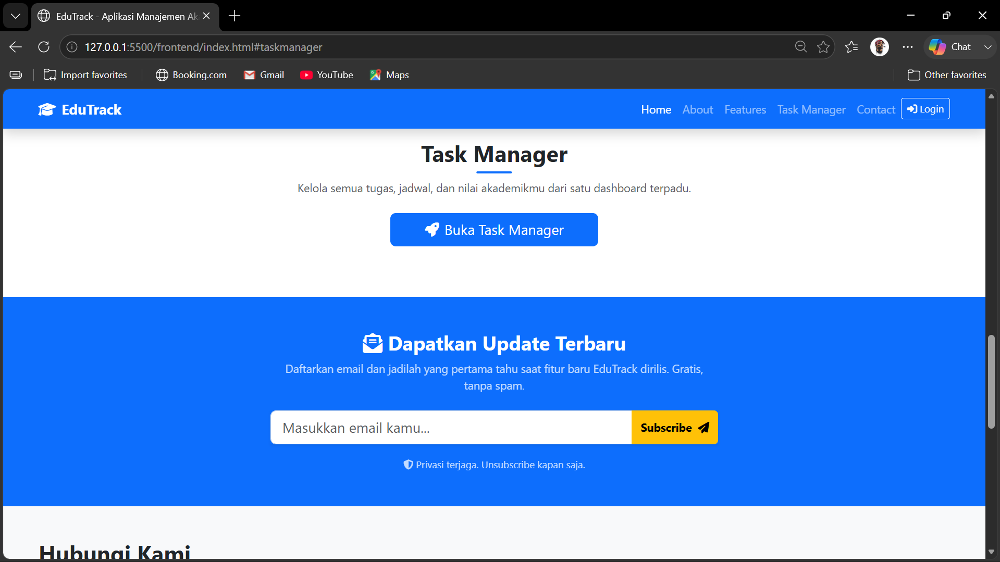

# EduTrack 🎓

EduTrack adalah platform manajemen akademik berbasis web yang membantu mahasiswa mengelola perkuliahan secara efisien — mulai dari tugas, jadwal kuliah, hingga monitoring nilai dan IPK.

## Fitur

- **Manajemen Tugas** — Catat, prioritaskan, dan pantau tugas kuliah dengan filter status, prioritas, dan mata kuliah
- **Jadwal Kuliah** — Atur jadwal dalam tampilan grid kalender dengan deteksi bentrok otomatis
- **Monitoring Nilai** — Pantau nilai angka, huruf, bobot, dan IPK per semester dengan visualisasi distribusi
- **Profil Akademik** — Ringkasan IPK, SKS, progress tugas, jadwal hari ini, dan grafik IPK per semester
- **Autentikasi JWT** — Register, login, dan manajemen session dengan token
- **Responsive Design** — Tampilan mobile-friendly dengan Bootstrap 5

## Tech Stack

| Layer    | Teknologi                                                  |
| -------- | ---------------------------------------------------------- |
| Frontend | HTML5, Bootstrap 5, Font Awesome 6, JavaScript (Fetch API) |
| Backend  | Node.js, Express.js                                        |
| Database | MySQL (mysql2/promise)                                     |
| Auth     | JWT (jsonwebtoken) + bcryptjs                              |
| Upload   | Multer                                                     |

## Struktur Proyek

```
edutrack1/
├── backend/
│   ├── config/db.js              # Koneksi database (pool)
│   ├── controllers/              # Logic setiap fitur
│   ├── middleware/               # Auth middleware (JWT)
│   ├── routes/                   # Routes API
│   ├── uploads/profiles/         # Foto profil user
│   └── server.js                 # Entry point
├── frontend/
│   ├── css/                      # CSS per halaman
│   │   ├── index.css
│   │   ├── jadwal.css
│   │   ├── nilai.css
│   │   ├── profile.css
│   │   └── tugas.css
│   ├── js/                       # JavaScript per halaman
│   │   ├── index.js
│   │   ├── jadwal.js
│   │   ├── login.js
│   │   ├── nilai.js
│   │   ├── profile.js
│   │   ├── register.js
│   │   ├── taskmanager.js
│   │   ├── tugas.js
│   │   └── broadcast.js
│   ├── auth-check.js             # Middleware auth sisi frontend
│   ├── style.css                 # Shared styles
│   ├── broadcast.html            # Halaman kirim newsletter
│   └── *.html                    # Halaman aplikasi lainnya
├── database/
│   └── edutrack_db.sql           # Schema database
├── docs/
│   ├── API.md                    # Dokumentasi API
│   └── testing-checklist.md      # Checklist testing
├── img/                          # Gambar landing page
├── .env                          # Konfigurasi environment
└── package.json
```

## Instalasi & Menjalankan

### 1. Clone repositori

```bash
git clone https://github.com/marioobe/edutrackV2.git
cd edutrackV2
```

### 2. Install dependencies

```bash
npm install
```

### 3. Setup database

Buat database MySQL dan import schema:

```bash
mysql -u root -p < database/edutrack_db.sql
```

### 4. Konfigurasi environment

Buat file `.env` di root proyek:

```env
DB_HOST=localhost
DB_USER=root
DB_PASSWORD=
DB_NAME=edutrack1_db
PORT=3000
JWT_SECRET=your_jwt_secret_key_change_this

# SMTP (Gmail) — untuk fitur broadcast newsletter
# SMTP_EMAIL=your.email@gmail.com
# SMTP_PASSWORD=your_app_password
```

> **Untuk Gmail App Password:** Buka [Google App Passwords](https://myaccount.google.com/apppasswords), buat password untuk Mail, lalu isikan ke `SMTP_PASSWORD`.

### 5. Jalankan server

```bash
npm start
```

Server berjalan di `http://localhost:3000`.

### 6. Buka aplikasi

Buka file `frontend/index.html` di browser atau jalankan langsung dari `http://localhost:3000` (jika sudah di-serve).

## API Endpoints

Base URL: `http://localhost:3000/api`

| Method | Endpoint                    | Auth | Deskripsi                            |
| ------ | --------------------------- | ---- | ------------------------------------ |
| POST   | /api/auth/register          | -    | Daftar akun baru                     |
| POST   | /api/auth/login             | -    | Login                                |
| GET    | /api/auth/profile           | ✅   | Ambil profil user                    |
| PUT    | /api/auth/profile           | ✅   | Update profil                        |
| PUT    | /api/auth/password          | ✅   | Ganti password                       |
| GET    | /api/tasks                  | ✅   | Ambil semua tugas                    |
| POST   | /api/tasks                  | ✅   | Tambah tugas                         |
| PUT    | /api/tasks/:id              | ✅   | Edit tugas                           |
| DELETE | /api/tasks/:id              | ✅   | Hapus tugas                          |
| PATCH  | /api/tasks/:id/toggle       | ✅   | Toggle status tugas                  |
| GET    | /api/matkul                 | ✅   | Ambil mata kuliah                    |
| POST   | /api/matkul                 | ✅   | Tambah mata kuliah                   |
| DELETE | /api/matkul/:id             | ✅   | Hapus mata kuliah                    |
| GET    | /api/jadwal                 | ✅   | Ambil jadwal                         |
| POST   | /api/jadwal                 | ✅   | Tambah jadwal                        |
| PUT    | /api/jadwal/:id             | ✅   | Edit jadwal                          |
| DELETE | /api/jadwal/:id             | ✅   | Hapus jadwal                         |
| GET    | /api/nilai                  | ✅   | Ambil nilai                          |
| POST   | /api/nilai                  | ✅   | Tambah nilai                         |
| PUT    | /api/nilai/:id              | ✅   | Edit nilai                           |
| DELETE | /api/nilai/:id              | ✅   | Hapus nilai                          |
| POST   | /api/contact                | -    | Kirim pesan kontak                   |
| GET    | /api/newsletter/subscribers | ✅   | Ambil daftar subscriber              |
| POST   | /api/newsletter/send        | ✅   | Kirim newsletter ke semua subscriber |
| POST   | /api/newsletter/subscribe   | -    | Berlangganan newsletter              |

## Screenshots

| Home                  | About                   |
| --------------------- | ----------------------- |
|  |  |

| Features                      | Task Manager                          |
| ----------------------------- | ------------------------------------- |
|  |  |

| Contact                     |
| --------------------------- |
|  |

## Dibuat Oleh

**Kelompok 3** — Proyek Pengembangan Web
